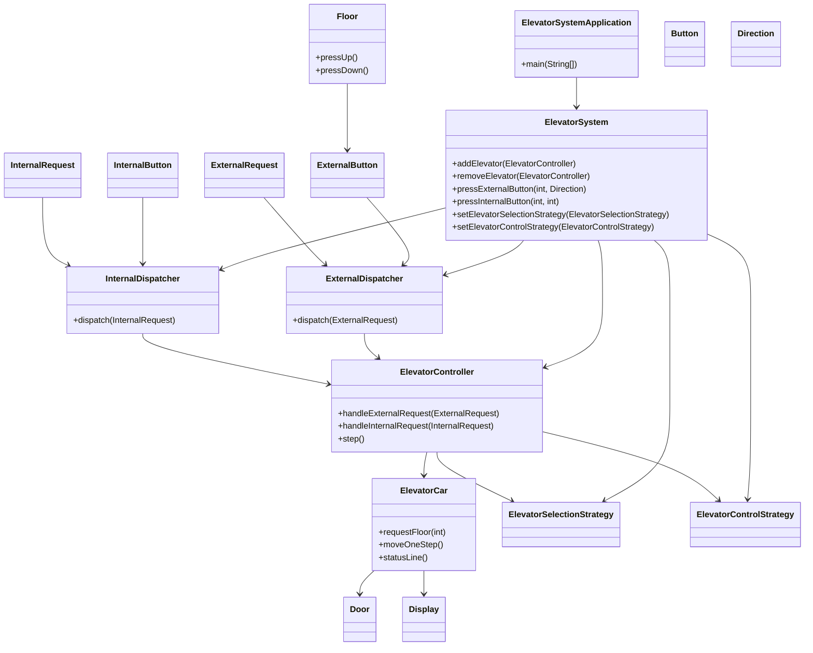
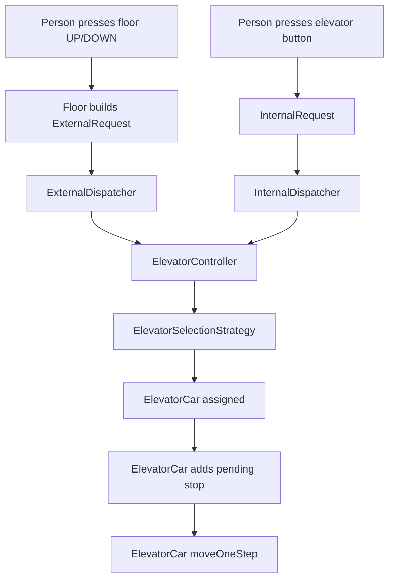

# Elevator System Low-Level Design

## Overview

This project implements a dynamic elevator system with:
- multiple floors
- multiple elevators
- dynamic elevator add/remove support
- external and internal request handling
- pluggable elevator selection and elevator control strategies

## Project Structure

```
ElevatorDesign/
├── README.md
└── src/
    └── com/elevator/
        ├── app/
        │   └── Main.java
        ├── core/
        │   ├── Button.java
        │   ├── Direction.java
        │   ├── Display.java
        │   ├── Door.java
        │   ├── ElevatorCar.java
        │   ├── ElevatorController.java
        │   ├── ElevatorSystem.java
        │   ├── ExternalButton.java
        │   ├── ExternalRequest.java
        │   ├── Floor.java
        │   ├── InternalButton.java
        │   └── InternalRequest.java
        ├── dispatcher/
        │   ├── ExternalDispatcher.java
        │   └── InternalDispatcher.java
        └── strategy/
            ├── control/
            │   ├── ElevatorControlStrategy.java
            │   ├── FirstComeFirstServe.java
            │   ├── LookAlgorithm.java
            │   ├── ScanAlgorithm.java
            │   └── ShortestSeekTime.java
            └── selection/
                ├── ElevatorSelectionStrategy.java
                ├── OddEvenStrategy.java
                └── ZoneStrategy.java
```

## Package Layout

- `com.elevator.app`
  - `Main` — application entry point and simulation driver.
- `com.elevator.core`
  - core elevator domain classes, request models, and UI primitives.
- `com.elevator.dispatcher`
  - request routers for external floor calls and internal elevator button presses.
- `com.elevator.strategy.selection`
  - elevator selection strategies for external requests.
- `com.elevator.strategy.control`
  - individual elevator control strategies for choosing the next floor.

## Object Construction: Step by Step

### Step 1: Basic types and primitives

Start with the most fundamental building blocks that represent the elevator system state.

- `Direction` models motion: `UP`, `DOWN`, `NONE`.
- `Door` tracks whether the elevator door is open.
- `Display` presents current floor, direction, and status.

These are separate because each concept has its own behavior and state.

### Step 2: Input models

Next, model the sources of requests.

- `Button` is the base abstraction for input controls.
- `ExternalButton` represents floor call buttons.
- `InternalButton` represents buttons inside the elevator.

- `ExternalRequest` packages a floor call plus direction.
- `InternalRequest` packages the elevator id and desired destination.

This separation makes external and internal requests explicit.

### Step 3: Floors

- `Floor` owns external buttons and can generate external requests.

Why: floors are the natural source of upward and downward elevator calls.

### Step 4: Elevator cabin behavior

- `ElevatorCar` represents one elevator.
- It stores current floor, direction, door state, display state, and pending stops.
- It exposes `requestFloor(int)` so both external and internal requests can add stops.
- It uses `moveOneStep()` to simulate motion and door operations.

Why: each elevator has its own state and decision logic, so `ElevatorCar` is a self-contained unit.

### Step 5: Strategy abstractions

- `ElevatorSelectionStrategy` decides which elevator should respond to an external call.
- `ElevatorControlStrategy` decides the next floor for a specific elevator.

Why: behavior should be pluggable so the system can swap algorithms without rewriting the core model.

### Step 6: Controller

- `ElevatorController` manages the fleet of `ElevatorCar` objects.
- It assigns external requests using the selection strategy.
- It forwards internal requests to the correct elevator.
- It advances all cars on each tick.

Why: the controller centralizes coordination while cars remain responsible for their own movement.

### Step 7: Dispatchers

- `ExternalDispatcher` routes floor calls into the controller.
- `InternalDispatcher` routes elevator button presses into the controller.

Why: separating request routing preserves clean boundaries and makes the controller easier to test.

### Step 8: System assembly

- `ElevatorSystem` builds floors, controller, and dispatchers.
- It exposes public methods like `pressExternalButton()` and `pressInternalButton()`.

Why: the system class is the external API that hides construction details and orchestration.

## UML Diagrams

### Class Diagram



### Request Flow Diagram



## How to Build

From the repository root:

```bash
mkdir -p out
find src/main/java -name '*.java' | sort | xargs javac -d out
```

## How to Run

```bash
java -cp out ElevatorSystemApplication
```

## Supported Strategies

- `OddEvenStrategy` — groups floor calls by odd/even elevator assignment.
- `ZoneStrategy` — assigns elevators based on floor zones.
- `FirstComeFirstServe` — processes elevator stops in order of arrival.
- `ShortestSeekTime` — selects the closest stop to reduce travel.
- `ScanAlgorithm` — sweeps in one direction until no stops remain.
- `LookAlgorithm` — similar to SCAN but reverses only when needed.

## Notes

- The README now includes the full project structure and class-level reasoning.
- Core elevator logic is grouped under `com.elevator.core`.
- Dispatchers and strategies remain separate for clean architecture.
