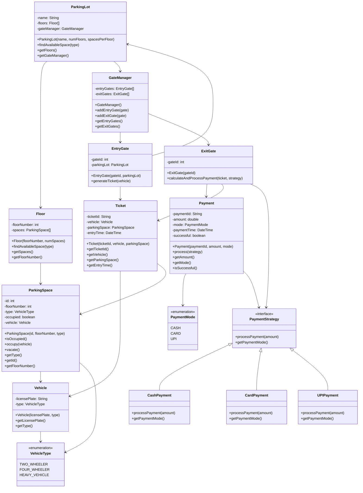

# Vehicle Parking System - Low Level Design (LLD)

## Overview

This document provides a comprehensive Low-Level Design (LLD) for a Vehicle Parking System. The system supports multiple vehicle types (two-wheeler, four-wheeler, heavy vehicles), multiple floors, entry/exit gates, ticket generation, and various payment methods. The design follows object-oriented principles with proper encapsulation, inheritance, and polymorphism.

## Architecture Overview

The system is structured around a central `ParkingLot` that manages multiple `Floor`s. Each `Floor` contains `ParkingSpace`s categorized by vehicle type. Vehicles enter through `EntryGate`s where tickets are generated, and exit through `ExitGate`s where payments are processed using different strategies.

## Project Structure

```
VehicleParking/
├── VehicleParking.iml
├── src/
│   ├── Main.java
│   └── com/parkinglot/
│       ├── enums/
│       │   ├── VehicleType.java
│       │   └── PaymentMode.java
│       ├── vehicle/
│       │   └── Vehicle.java
│       ├── parking/
│       │   ├── ParkingLot.java
│       │   ├── Floor.java
│       │   └── ParkingSpace.java
│       ├── gate/
│       │   ├── EntryGate.java
│       │   ├── ExitGate.java
│       │   └── GateManager.java
│       ├── ticket/
│       │   └── Ticket.java
│       └── payment/
│           ├── Payment.java
│           ├── PaymentStrategy.java
│           ├── CashPayment.java
│           ├── CardPayment.java
│           └── UPIPayment.java
└── README.md
```

## Class Structure

### ParkingLot
**Responsibility:** Manages the entire parking facility including floors and gates, and coordinates parking space allocation.

### Floor
**Responsibility:** Represents a single level in the parking lot and manages parking spaces within that level.

### ParkingSpace
**Responsibility:** Represents an individual parking spot that can be occupied by a vehicle of specific type.

### Vehicle
**Responsibility:** Represents a vehicle with its license plate and type information.

### Ticket
**Responsibility:** Contains parking details including vehicle, space assignment, and entry time for billing.

### EntryGate
**Responsibility:** Handles vehicle entry by generating tickets and assigning parking spaces.

### ExitGate
**Responsibility:** Processes vehicle exit by calculating parking fees and handling payments.

### GateManager
**Responsibility:** Manages all entry and exit gates in the parking system.

### Payment
**Responsibility:** Represents a payment transaction with amount, method, and processing status.

### PaymentStrategy (Interface)
**Responsibility:** Defines the contract for different payment method implementations.

### CashPayment
**Responsibility:** Implements cash-based payment processing.

### CardPayment
**Responsibility:** Implements card-based payment processing.

### UPIPayment
**Responsibility:** Implements UPI-based payment processing.

### VehicleType (Enum)
**Responsibility:** Defines supported vehicle categories (two-wheeler, four-wheeler, heavy vehicle).

### PaymentMode (Enum)
**Responsibility:** Defines available payment methods (cash, card, UPI).

## UML Class Diagram



## Key Design Patterns Used

1. **Strategy Pattern**: Used for payment processing with different payment methods
2. **Factory Pattern**: Implicit in gate creation and space allocation
3. **Composition**: ParkingLot composed of Floors and GateManager
4. **Enumeration**: For type-safe constants (VehicleType, PaymentMode)

## Flow of Operations

1. **Entry**: Vehicle arrives → EntryGate generates Ticket → ParkingSpace allocated and occupied
2. **Parking**: Vehicle parks in assigned space
3. **Exit**: Vehicle presents Ticket → ExitGate calculates duration and fee → Payment processed → ParkingSpace vacated

This design ensures scalability, maintainability, and adherence to SOLID principles.