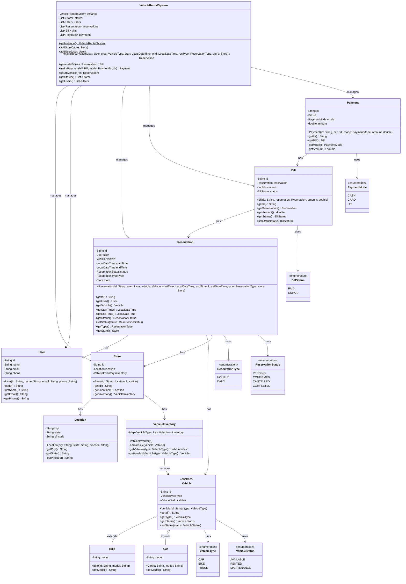

# Vehicle Rental System - Low Level Design (LLD)

## Project Structure

The project is organized into a clean package structure to promote modularity, maintainability, and scalability. Below is the directory tree:

```
VehicleRental/
├── src/
│   ├── com/
│   │   └── vehiclerental/
│   │       ├── enums/
│   │       │   ├── VehicleType.java          # Enum for vehicle types (CAR, BIKE, TRUCK)
│   │       │   ├── VehicleStatus.java        # Enum for vehicle statuses (AVAILABLE, RENTED, MAINTENANCE)
│   │       │   ├── ReservationType.java      # Enum for reservation types (HOURLY, DAILY)
│   │       │   ├── ReservationStatus.java    # Enum for reservation statuses (PENDING, CONFIRMED, CANCELLED, COMPLETED)
│   │       │   ├── BillStatus.java           # Enum for bill statuses (PAID, UNPAID)
│   │       │   └── PaymentMode.java          # Enum for payment modes (CASH, CARD, UPI)
│   │       ├── model/
│   │       │   ├── Vehicle.java              # Abstract base class for vehicles
│   │       │   ├── Bike.java                 # Concrete class for bikes
│   │       │   ├── Car.java                  # Concrete class for cars
│   │       │   ├── Location.java             # Class representing geographical locations
│   │       │   ├── Store.java                # Class representing rental stores
│   │       │   ├── User.java                 # Class representing system users/customers
│   │       │   ├── Reservation.java          # Class representing vehicle reservations
│   │       │   ├── Bill.java                 # Class representing billing information
│   │       │   └── Payment.java              # Class representing payment transactions
│   │       ├── inventory/
│   │       │   └── VehicleInventory.java     # Class managing vehicle inventory per store
│   │       └── service/
│   │           └── VehicleRentalSystem.java  # Main service class implementing business logic
│   └── Main.java                             # Entry point with demo usage
├── VehicleRental.iml                         # IntelliJ IDEA project file
└── README.md                                 # This documentation file
```

## Design Thinking Process

The Low Level Design (LLD) for the Vehicle Rental System was developed through a systematic, step-by-step approach that focused on identifying core entities, establishing relationships, and implementing clean architecture principles. Here's how we thought through and created the different objects:

### Step 1: Understand the Problem Domain
- **Analysis**: We identified the core business requirements - users should be able to rent vehicles (cars, bikes) from stores, make reservations, generate bills, and process payments.
- **Key Entities Identified**: User, Vehicle, Store, Reservation, Bill, Payment
- **Relationships Considered**: Users make reservations for vehicles at stores, reservations generate bills, bills are paid through payments.

### Step 2: Define Enums for Constants
- **Purpose**: To create type-safe constants that prevent invalid values and improve code readability.
- **Created Objects**:
  - `VehicleType`: Defines the types of vehicles available (CAR, BIKE, TRUCK)
  - `VehicleStatus`: Tracks the current state of vehicles (AVAILABLE, RENTED, MAINTENANCE)
  - `ReservationType`: Specifies rental duration types (HOURLY, DAILY)
  - `ReservationStatus`: Manages reservation lifecycle (PENDING, CONFIRMED, CANCELLED, COMPLETED)
  - `BillStatus`: Tracks payment status (PAID, UNPAID)
  - `PaymentMode`: Defines accepted payment methods (CASH, CARD, UPI)

### Step 3: Design Core Model Classes
- **Base Classes**: Started with `Vehicle` as an abstract class to define common attributes (id, type, status) and behaviors.
- **Inheritance**: Created `Bike` and `Car` as concrete implementations extending `Vehicle`, each with specific attributes like model.
- **Supporting Classes**:
  - `Location`: Represents geographical information for stores
  - `User`: Contains customer information
  - `Store`: Represents physical rental locations with associated inventory

### Step 4: Implement Business Logic Classes
- **Reservation System**: `Reservation` class links users, vehicles, time periods, and stores. It includes status tracking and type specification.
- **Billing System**: `Bill` class calculates and tracks charges based on reservation details.
- **Payment System**: `Payment` class handles transaction processing with different payment modes.

### Step 5: Create Management Classes
- **Inventory Management**: `VehicleInventory` uses a Map-based structure to efficiently manage vehicles by type and track availability.
- **Service Layer**: `VehicleRentalSystem` implements the Singleton pattern to provide a centralized service for all operations (reservations, billing, payments, returns).

### Step 6: Establish Relationships and Dependencies
- **Composition**: Store contains Location and VehicleInventory
- **Aggregation**: VehicleRentalSystem manages collections of Stores, Users, Reservations, Bills, and Payments
- **Association**: Reservation associates User, Vehicle, and Store; Bill links to Reservation; Payment connects to Bill

### Step 7: Implement Business Methods
- **Reservation Flow**: `makeReservation()` checks availability, creates reservation, updates vehicle status
- **Billing Flow**: `generateBill()` calculates charges based on duration and rate
- **Payment Flow**: `makePayment()` processes transactions and updates bill status
- **Return Flow**: `returnVehicle()` completes reservation and makes vehicle available again

### Step 8: Package Organization
- **Separation of Concerns**: Grouped related classes into packages (enums, model, inventory, service)
- **Dependency Management**: Ensured proper import statements and avoided circular dependencies
- **Scalability**: Structure allows easy addition of new vehicle types, payment methods, or features

### Step 9: Testing and Validation
- **Demo Implementation**: Created Main.java with a complete usage scenario
- **Compilation Check**: Verified all classes compile without errors
- **Runtime Testing**: Executed the demo to ensure all interactions work correctly

This step-by-step approach ensured a robust, maintainable design that follows SOLID principles and provides a solid foundation for the vehicle rental system.

## UML Class Diagram

